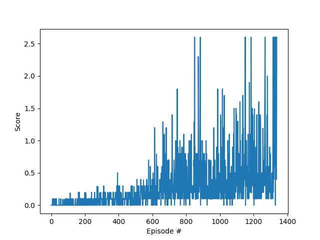
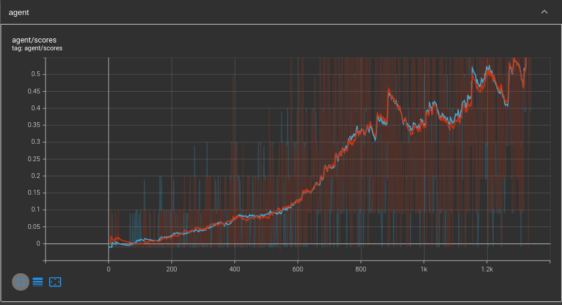
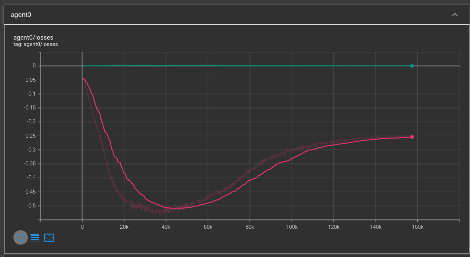
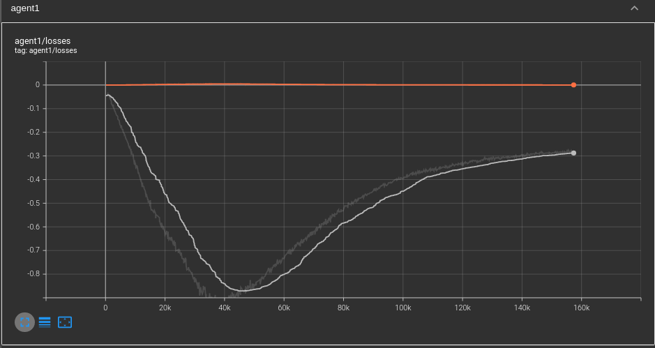

# Report

This document describes the architecture of the DDPG that is implemented to solve the tennis problem.

## Details of the Implementation
The implementation for this approach is based on a very primitive adaption of the DDPG Agent used in project 2.
In this scenario we take two agents that are based on DDPG. Each of them learns indepently and estimates an action.
The combined actions of these two agents are then the input into the environment.
This is a simplistic approach as the learning of one agent doesn't take into acount the action the other agent does.
Nevertheless, the approach is sufficient to reach an average score of 0.5 over 100 episodes.

### Architecture DDPG
The DDPG Architecture consists of an Actor and an Critic

#### Architecture of the Actor
The neural network consists of 3 fully connected layers.
The input layers consists of 33 neurons, which correspond to the size of the state space.
The first hidden layer consists of 400 neurons.
The second hidden layer consists of 300 neurons.
The output layer consists of 4 neurons, which corresponds to the size of the action space.

The layers except the output layer are using a RELU activiation function. The output layer uses a tanh function to map
the result in the range between -1 and 1, wich is the range of the actions.

#### Architecture of the Critic
The neural network consists of 3 fully connected layers.
The input layers consists of 24 neurons, which correspond to the size of the state space
The first hidden layer consists of 260 (256 + 4) neurons.
The second hidden layer consists of 128 neurons.
The output layer consists of 1 neuron. This is the expected reward that can be reached by making action as in state s.

The layers except the output layer are using a RELU activiation function.

### Adam Opimizer
As optimizer I chose Adam (Adaptive Moment Estimation). It's an extension to stochastic gradient descent.
It was chosen as the [Paper](https://arxiv.org/abs/1412.6980) mentions multiple advantages
* Computationally efficient
* Has little memory requirements
* Is invariant to diagonal rescaling of the gradients
* Is well suited for problems that are large in terms of data and/or parameters.
* It is also appropriate for non-stationary objectives and problems with very noisy and/or sparse gradients.
* The hyper-parameters have intuitive interpretations and typically require little tuning.

### Loss Function

#### Critic
As loss function for the Critic I chose the Mean Squared Error (MSE). This is just based on the fact that it is the most common one.

The advantage is that outlier are reduced as MSE puts higher weight on the large error.

The disadvantage comes directly from the advantage. The outlier have a high influence in the MSE, but in general we don't much care about these outlier.
Thus, for improving the results in this environment it would make to chose a different loss function.

### Actor
The loss function for the Actor is the negativ mean of estimation of the Critic. The negativ is needed as we want to make a maximization, but the optimizer makes a minimization.

### Hyper Parameter
There are 6 hyperparameter use in the network. They are listed below. None of them has any spceial value. Most of them are set to standard parameters or 
values that are not special. There is no big reasoning behind them. They just work. By varying the parameters and comparing the performance of the corresponding
networks an even better set can be found. 

* The replay buffer size is 1e6
* The batch size is 512
* Gamma is set to 0.99
* The update of the target parameters is set to 1e-2
* The target parameters are updated each step
* The learning rate is set to 1e-3

### Replay Buffer
The algorithm uses a replay buffer to improve the performance of the algorithm. The buffer is a very basic implementation and just stores the experiences. In the learning phase the algorithm
randomly samples from the buffer.

The advantage of the buffer is to break the timely coupling of the experiences. It also allows for using experiences multiple times (e.g. recall rare experiences).

### Noise
The original paper uses the Ornstein-Uhlenbeck Noise. Recent papers have shown that this more complex model is not
needed. Thus, I used a Gaussian Noise that is decayed in each episode

## Improvements
There are multiple extensions to the algorithm that would most probably improve the results. An algorithm that contains six extensions that are listed below is called rainbow DQN.
* Prioritized experience replay
* Learning from multi-step bootstrap targets
* Implementing a real MADDPG algorithm
    * This means that the agent don't learn independently. Instead the critic of each agent takes into account the action of the other agent as well.

## Current Performance
The current performance of the network achieves the required reward of 0.5 over a 100 episodes. Thus, no additional extensions are implemented. There are still quite some general ideas that easily could improve the performance. They are listed in the section below.

This plot shows the scores of both agent over the episodes.
agent0 is red and agent1 is blue

This plot shows the critic and actor loss of agent0 for each learning step.
The critic loss in green.
The actor loss is in red

This plot shows the critic and actor loss of agent1 for each learning step
The critic loss in orange.
The actor loss is in white

